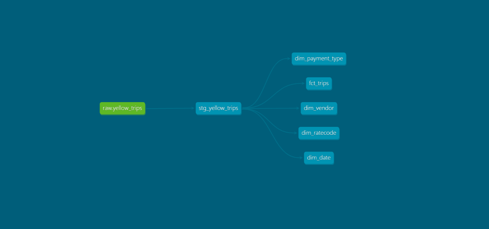

# NYC Taxi Data Warehouse — Snowflake + dbt

An end-to-end analytics engineering project: ingesting ~3M NYC yellow-taxi trip records into Snowflake and transforming them into a dimensional star schema with dbt, complete with automated data-quality testing and documentation.

## Architecture

Raw Parquet → Snowflake (raw) → dbt staging (clean + type-cast) → star schema (4 dimensions + fact) → 16 automated tests

## Stack
- **Snowflake** — cloud data warehouse
- **dbt** — transformation, testing, documentation
- **SQL** — modeling logic

## Data Model
**Staging** (`stg_yellow_trips`): renames raw columns, casts types, filters invalid rows (zero passengers/distance/fare).

**Dimensions**: `dim_vendor`, `dim_ratecode`, `dim_payment_type`, `dim_date` — decode numeric codes into readable labels.

**Fact** (`fct_trips`): one row per trip with surrogate key, foreign keys to dimensions, measures (fares, distance, tips), and a derived `trip_duration_minutes`.

## Data Quality
16 automated dbt tests: uniqueness and not-null on all primary keys, plus referential-integrity (`relationships`) tests confirming every fact foreign key resolves to its dimension.

## Key Concepts Applied
- Dimensional modeling (star schema)
- ELT with staging-layer type casting
- Surrogate key generation (`dbt_utils`)
- Referential integrity testing
- Data lineage & auto-generated documentation